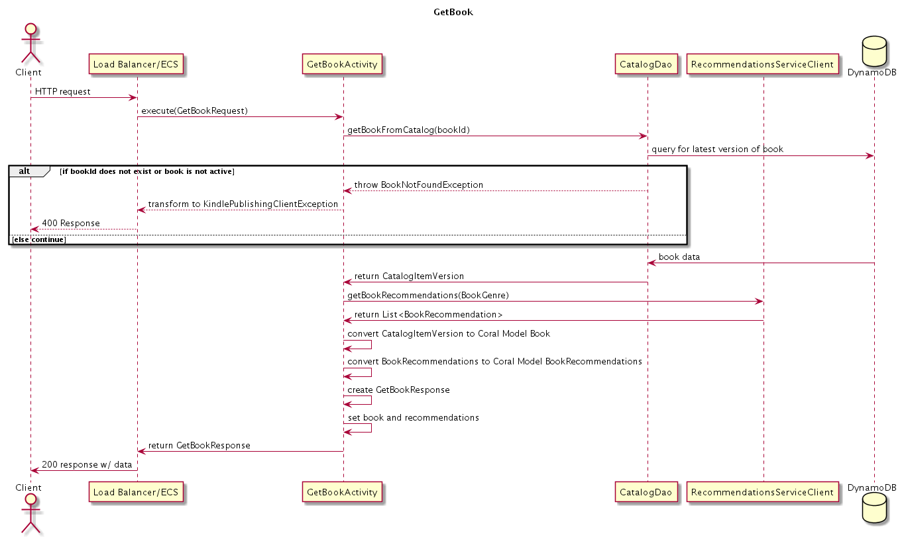
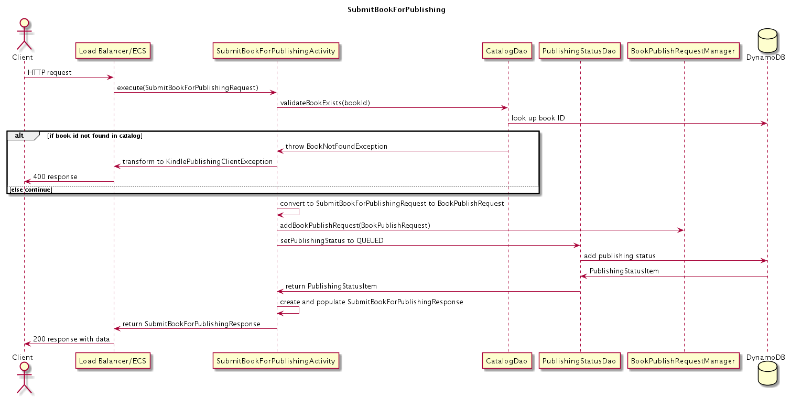
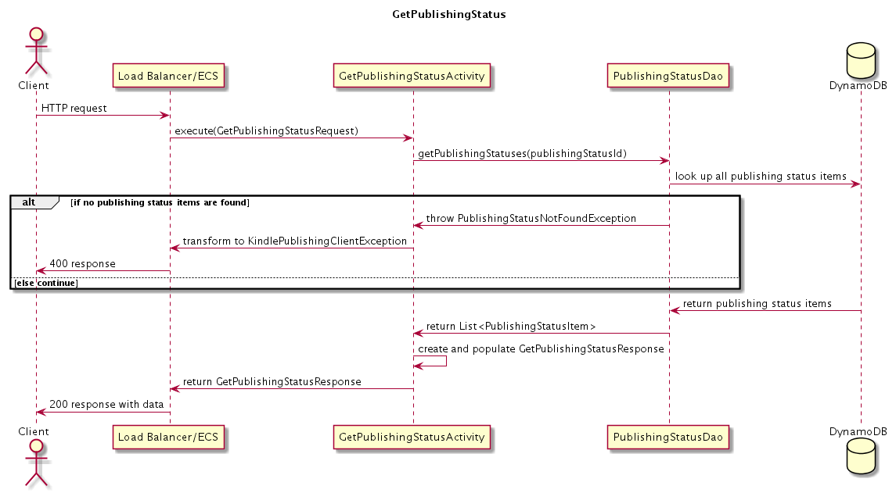
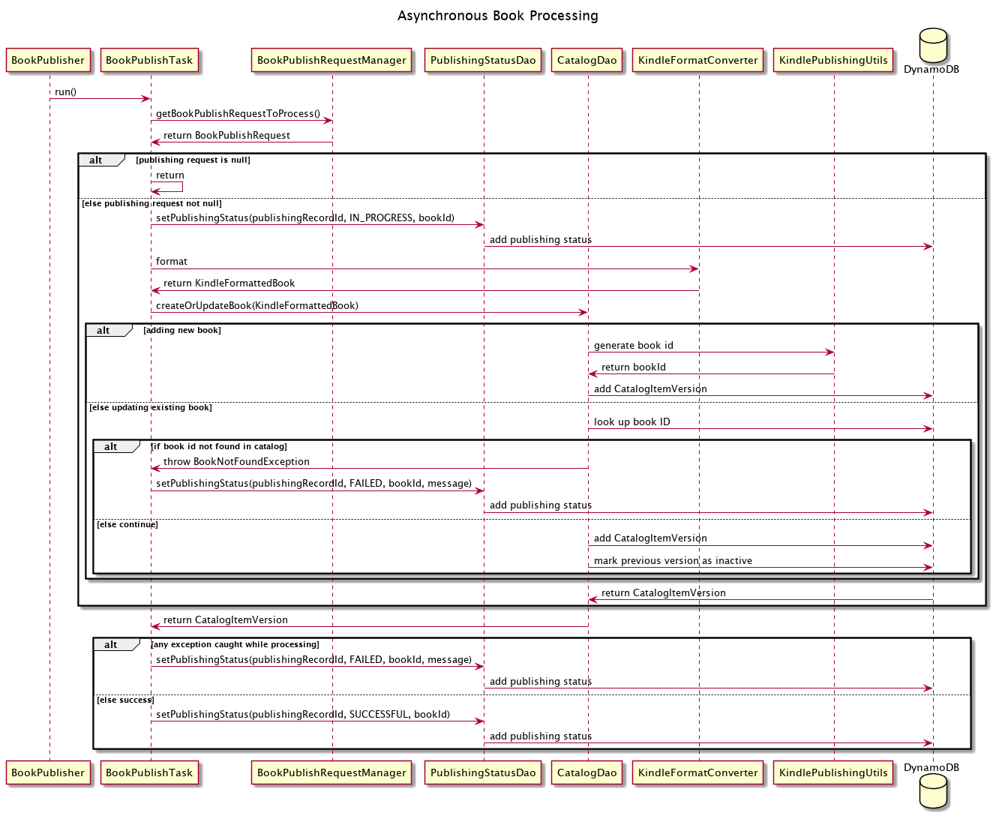

# Unit 6 Project Design Doc

## Background

The Amazon Kindle store provides millions of ebooks to our customers. The process of publishing an
ebook to the Kindle catalog is currently an extremely manual process, which causes a long wait time
to add a book to the catalog.

This design document describes the Amazon Kindle Publishing Service, a new, native AWS service
that will provide the ability to publish books to the Kindle catalog, access published Kindle books
in the catalog, and remove published Kindle books from the catalog.

This initial iteration will provide the minimum lovable product (MLP) defined by our product team.

## Glossary

**Book** - A Kindle ebook that can be purchased by customers on the retail website.

**Catalog** - the entire set of Kindle ebooks at Amazon.

**Version** - A way to track changes to a Kindle ebook. Each time an update is made to the ebook,
a new version is made available to customers.

**Recommendation** - A recommended book for customers to purchase.

**MLP** - Minimum Lovable Product. The minimum set of features in our product to provide for
customers to ensure they love our product.

## Business Requirements

* As a user, I want to retrieve a book from the Kindle catalog.
* As a user, I want to retrieve recommendations related to a book in the Kindle catalog.
* As a user, I want to submit my book for publication into the Kindle catalog.
* As a user, I want to see the current status of my book publishing submission.
* As a user, I want to remove my book from the Kindle catalog.

## Architecture


*Figure 1: Diagram showing the architecture of the Kindle Publishing Service. A user connects to an
Amazon Kindle Publishing Client. The Client makes API calls to the Kindle Publishing Service first connecting
with an AWS load balancer. This forwards the requests to ECS, which connects to a persistent data store for catalog
and publishing information Responses then flow bck to the Kindle Publishing Client.*

## Kindle Publishing Service API Implementation Notes

### General

* We’ve created a starter service package with an implementation of the `GetBook` operation. This
comes along with a `CatalogDao` that communicates with the `CatalogItemVersions` table, as well as
a `RecommendationServiceClient` that communicates with the `RecommendationService`.
* We’ve provided a `PublishingStatusDao` class with some methods that you’ll use to set the
publishing status of a book publish request. We’ve also provided a DynamoDB model
`PublishingStatusItem` which is used by `PublishingStatusDao`.
* Our team has also provided a `KindlePublishingUtils` class that helps with generating `bookIds`,
`publishingRecordIds`, and a publishing status message. It exposes the below methods:
    * `String generateBookId()`
    * `String generatePublishingRecordId()`
    * `String generatePublishingStatusMessage(PublishingRecordStatus status)`
* There is one initial custom exceptions created for the Kindle Publishing service that can be
thrown (as noted below):
    * `BookNotFoundException`

Below are the endpoints required to provide the MLP business requirements.

### Kindle Catalog Versioning

When a book in the Kindle catalog needs to be updated we will not update the book in place. We want
to preserve all of the previous versions of the book that was in our catalog. To support this, we
have a DynamoDB table `CatalogItemVersions` which has the version number as the sort key and
includes a boolean field `inactive` to indicate whether this book is the latest active version of
the book. When we add a brand new book into the Kindle catalog, it is added into
`CatalogItemVersions` with version 1 and `inactive = false`. When we update that same book, it will
be added as a new item in `CatalogItemVersions` with version 2 and `inactive = false`, and version 1
item would be marked with `inactive = true`.

### `GetBook`

* Retrieves the latest active version of a book from the catalog with a given book id.
* Returns a list of book recommendations related to the book. These are retrieved from the
`RecommendationService`.
* Returns book only if the book is currently active (based on the `inactive` field in
`CatalogItemVersions` table).
* Throws a `BookNotFoundException` when given book id is not found or the corresponding book is
not active in the catalog.
* We have configured the API to require a non-empty book id in the request, otherwise a `ValidationException`
will be thrown. You do not have to account for this.

```
GetBookRequest {
    "bookId": "book.69c16130-60b5-485a-8326-7f79d3feb36d"
}
```

```
GetBookResponse {
    "book": {
        "author": "Maurice Sendak",
        "bookId": "book.69c16130-60b5-485a-8326-7f79d3feb36e",
        "genre": "FANTASY",
        "text": "The night wore his wolf suit...",
        "title": "Where the Wild Things Are",
        "version": 1
    },
    "recommendations":
     [
        {"asin": "B07XZDZWG3",
         "author": "Eric J. Vann",
         "title": "Soul Weaver (The Seeded Realms Book 1)"},
        {"asin": "B00PQRJJY0",
         "author": "Morgan Rice",
         "title": "Rise of the Dragons (Kings and Sorcerers--Book 1)"},
        {"asin": "0316438979",
         "author": "Andrzej Sapkowski",
         "title": "The Witcher Boxed Set: Blood of Elves, The Time of Contempt, Baptism of Fire"}
     ]
}
```

### `RemoveBookFromCatalog`

* Removes a book from the catalog with a given book id.
* This deactivates the latest version of the book in the `CatalogItemVersions` table by changing
its `inactive` attribute to `true`.
* After a successful call to `RemoveBookFromCatalog` for a book id, the `GetBook` call for the
same book id should throw a `BookNotFoundException`
* Throws a `BookNotFoundException` when given book id is not found or the corresponding book is
not active in the catalog.
* We have configured the API to require a non-empty book id in the request, otherwise a `ValidationException`
will be thrown. You do not have to account for this.
```
RemoveBookFromCatalogRequest {
    bookId: "book.69c16130-60b5-485a-8326-7f79d3feb36d"
}
```

```
RemoveBookFromCatalogResponse {
    // Empty response object created for flexibility so that we can easily return
    // data in the future.
}
```

### `SubmitBookForPublishing`

* Accepts book assets and submits book for processing.
* To update an existing book, the request must contain the book’s associated `bookId`.
    * If a `bookId` is passed, we will validate that the book exists in the catalog. If no active or
        inactive book is found with the provided `bookId` is found, we throw a `BookNotFoundException`
    * (The previous version of the book will be marked inactive as part of the asynchronous
      publishing logic)
* If a `bookId` is not present in the request, then the submission will be considered for a new
    book, and a new `bookId` will be generated when the book is published.
* Inserts a book publishing request into the `BookPublishRequestManager` for asynchronous processing.
* Adds a record into the `PublishingStatus` table with publishing state `QUEUED`.
* Returns a generated `publishingRecordId` associated with the submission. This `publishingRecordId`
    is used to call `GetPublishingStatus` to get all of the publishing status information on the
    publish request.
* If the book submission is missing the `title`, `author`, `language`, `genre`, or `text`, a
    `ValidationException` will be thrown.
a `ValidationException` will be thrown. You do not have to account for this.

```
SubmitBookForPublishingRequest {
    "bookId": "book.b3750190-2a30-4ca8-ae1b-73d0d202dc41",
    "title": "Run Fast. Cook Fast. Eat Slow.: Quick-Fix Recipes for Hangry Athletes: A Cookbook",
    "author": "Shalane Flanagan",
    "text": "When I moved off the track, from racing 5,000 m and 10,000 m distances to the marathon, my training required... ",
    "genre": "COOKING"
}
```

```
SubmitBookForPublishingResponse {
    publishingRecordId: "publishingStatus.69c16130-60b5-485a-8326-7f79d3feb36d"
}
```

### `GetPublishingStatus`

* Accepts a `publishingRecordId` and returns the publishing status history of the book submission
    from the `PublishingStatus` table.
* A successful publishing request should start in the `QUEUED` state, transition to `IN_PROGRESS`,
    and end in `SUCCESSFUL`.
* A failed publishing request should start in the `QUEUED` state, transition to `IN_PROGRESS`, and
    end in `FAILED`.
    * The status message of a failed publishing request should contain details about the failure.
* When a `SUCCESSFUL` `PublishingStatus` has been reached, the `PublishingStatusRecord` should
    contain a `bookId`. If the publishing request was for an existing book, each
    `PublishingStatusRecord` will have a `bookId`.
* Throws a `PublishingRecordFoundException` when the provided `publishingRecordId` is not found in
    the `PublishingStatus` table.
* We have configured the API to require a non-empty publishing record ID in the request, otherwise  a
`ValidationException` will be thrown. You do not have to account for this.

```
GetPublishingStatusRequest {
    publishingRecordId: "publishingstatus.827a06ef-04ae-4754-995a-53ad4dc503b3"
}
```

```
GetPublishingStatusResponse {
    "publishingStatusHistory":
    [
        {"status": "IN_PROGRESS",
        "statusMessage": "Processing started at 2020-02-25 15:17:09.213"},
        {"status": "QUEUED",
        "statusMessage": "Queued for publishing at 2020-02-25 15:17:08.929"},
        {"bookId": "book.b3750190-2a30-4ca8-ae1b-73d0d202dc41",
        "status": "SUCCESSFUL",
        "statusMessage": "Book published at 2020-02-25 15:17:09.551"}
    ]
}
```

## Data Model

We will have two DynamoDB tables to support our service:

* **PublishingStatus**: Stores the current state and messaging of book submissions. States could
    include `QUEUED`, `IN_PROGRESS`, `SUCCESSFUL`, `FAILED`.
* **CatalogItemVersions**: Stores data about the books in the Kindle catalog. If an existing book
    is updated, then a new entry in the table is added with an updated version number. The previous
    version will be inactive.

Below are the data models for the DynamoDB tables.

### Publishing Status

* `publishingRecordId` (string, partition key)
* `status` (string, sort key)
* `statusMessage` (string)
* `bookId` (string)

### CatalogItemVersions

* `bookId` (string, partition key)
* `version` (number, sort key)
* `title` (string)
* `author` (string)
* `text` (string)
* `genre` (string)
* `inactive` (boolean)


## Class Diagram

<**MT01.MILESTONE 1**>

[Link to class diagram PUML file](src/resources/mastery-task1-kindle-publishing-CD.puml)


## API Sequence Diagrams

### GetBook



*[PlantUML source for diagram](https://tiny.amazon.com/8yicnch2/getBook)*

### RemoveBookFromCatalog

<**MT01.MILESTONE 1**>

[Link to sequence diagram PUML file](src/resources/mastery-task1-remove-book-SD.puml)

### SubmitBookForPublishing
**Update (03/11/19)**: the two original `setPublishingStatus` methods in the `PublishingStatusDao`
have been deprecated. If your MT02 is already using these. It is OK. Do not add any additional
calls to these methods.



*[PlantUML source for diagram](https://tiny.amazon.com/1f1qb1cfd/submitBook)*

### GetPublishingStatus



*[PlantUML source for diagram](https://tiny.amazon.com/1d2776gb8/getPub)*

## Asynchronous Book Publishing

When the App starts up, we make a call to start our `BookPublisher`. This schedules a
`Runnable` to execute repeatedly while the service runs.

We will have this `Runnable` retrieve a book publish request from `BookPublishRequestManager` and
perform the steps required for publishing a Kindle book into the catalog. For each
`BookPublishRequest` in the queue, the following steps are performed:

1. Adds an entry to the Publishing Status table with state `IN_PROGRESS`
2. Performs formatting and conversion of the book
3. Adds the new book to the `CatalogItemVersion` table
    1. If this request is updating an existing book:
        1. The entry in `CatalogItemVersion` will use the same `bookId` but with the
           version incremented by 1.
        1. The previously active version of the book will be marked inactive.
    2. Otherwise, a new `bookId` is generated for the book and the book will be stored in
        `CatalogItemVersion` as version 1.
4. Adds an item to the Publishing Status table with state `SUCCESSFUL` if all the processing steps
    succeed. If an exception is caught while processing, adds an item into the Publishing Status
    table with state `FAILED` and includes the exception message.



*[PlantUML source for diagram](https://tiny.amazon.com/1dasbgpgn/processing)*
