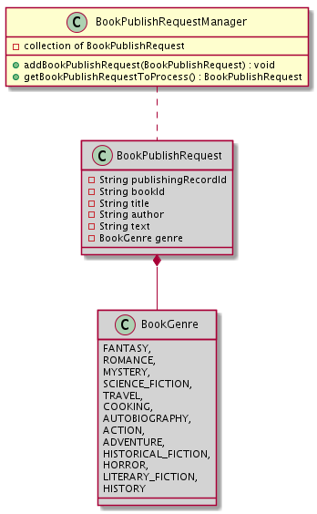

### Mastery Task 2:  Submit to the process

We currently have an API to retrieve books, but we need a way to submit Kindle books for publishing so we can continue
to grow our catalog!

Publishing a Kindle book is a long, multi-step process, so we can’t complete the whole process within a single API call.
To handle this, we’ve decided to save each book publish request into a class called
`BookPublishRequestManager` that will allow requests to be processed later. That way the caller of
`SubmitBookForPublishing` gets an immediate response with a `publishingRecordId` that they can use to check back on the
status of their book publish request by calling `GetPublishingStatus`. This is similar to the workflow for orders on
the Amazon retail website — you place an order and get an orderId back, which you can use later to check the current
status of your order. This is known as *asynchonous* processing, since our service doesn't make the user wait until
the entire publishing process completes.

The `BookPublishRequestManager` should manage a collection of book publish requests, ensuring that requests are
processed in the same order that they are submitted.

You will need to do the following:

* Create the `BookPublishRequestManager` class in the `com.amazon.ata.kindlepublishingservice.publishing` package.
* The `BookPublishRequest` class has been provided to you in the `com.amazon.ata.kindlepublishingservice.publishing`
  package.
* Implement `BookPublishRequestManager`'s `addBookPublishRequest` method which adds the given `BookPublishRequest`
  to the collection.
* Implement `getBookPublishRequestToProcess` which retrieves the next `BookPublishRequest` in line for publishing and
  returns it. If there are no requests to publish this should return `null`. This will be called in a later task when we
  implement processing the book publish requests.
* Since nothing is currently using the `BookPublishRequestManager` we don't need to update any Dagger classes yet. We
  can still set ourselves up with a more testable `BookPublishRequestManager` class by accepting any dependencies of
  our class into our constructor.

The `SubmitBookForPublishingActivity` currently only saves an item in the PublishingStatus table to record
that we have received the book publish request to be processed. Now that you have the `BookPublishRequestManager`,
finish the `SubmitBookForPublishing` operation by updating `SubmitBookForPublishingActivity`, to add
`BookPublishRequest`s to the manager for processing, based on the design doc's implementation notes and diagram.

We need to ensure we have added the correct `Provider` methods and annotated our constructors properly to make
inject our `BookPublishRequestManager`. The service is already setup to use Dagger.

Finally, in order to make sure we only attempt to publish books in our catalog, you will need to add a new void method
`validateBookExists` to the `CatalogDao` class, which the activity can call to check if the provided `bookId` exists
in the catalog, and throws a `BookNotFoundException` if it doesn’t. This is to meet the requirement in the design doc
where the book’s latest version in the catalog can be active or inactive, since we will allow users to publish a new
version of an inactive book. Make sure to add additional unit tests for this case!

To test your new API, try submitting requests with a non-existant `bookId,` with an active `bookId`, and with an
inactive `bookId` to ensure you are getting expected results back.

Run `MasteryTaskTwoSubmitBookForPublishingTests` and `MasteryTaskTwoBookPublishRequestManagerTests` to validate your changes.

**Exit Checklist:**

* You’ve built `BookPublishRequestManager`, which includes methods for adding and retrieving `BookPublishRequests`.
* You’ve updated `SubmitBookForPublishingActivity` according to the design doc, which allows books to be submitted
  for publishing and returns a response with a `publishingRecordId`.
* You added unit tests to cover your new code.
* `MasteryTaskTwoSubmitBookForPublishingTests` and `MasteryTaskTwoBookPublishRequestManagerTests` passes
